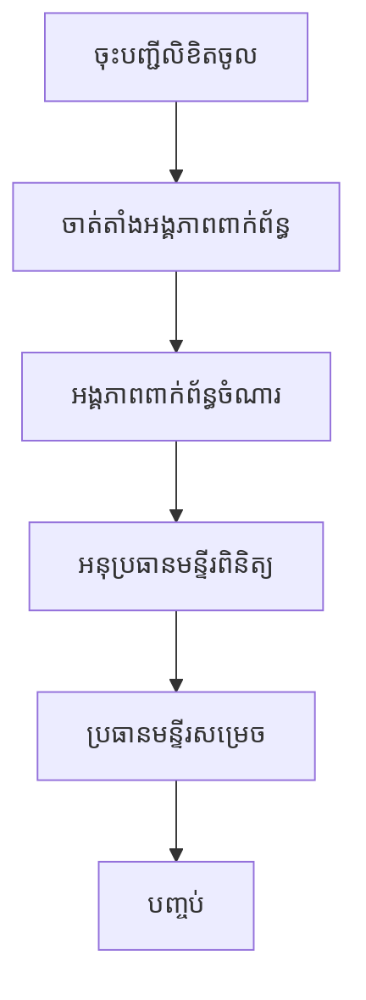
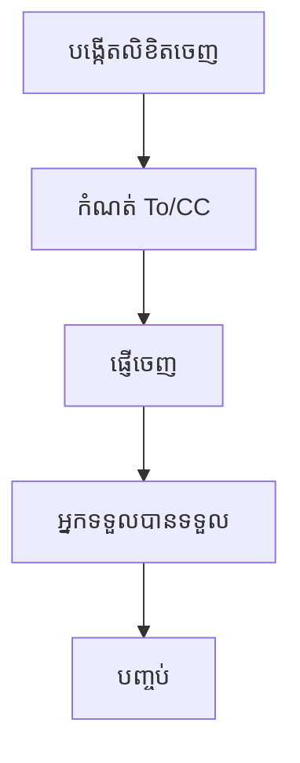

# Workflow Matrix — លំហូរការងារតាមស្តង់ដារ

ឯកសារនេះបង្ហាញលំដាប់ជំហានឱ្យច្បាស់ថា **តួនាទីណា អាចធ្វើអ្វី នៅពេលណា** ដើម្បីជៀសវាងជាន់សិទ្ធិ ឬរំលងជំហាន។

---

## ១) Workflow លិខិតចូល (Incoming)

| ជំហាន | ស្ថានភាព | អ្នកទទួលសិទ្ធិ | Action អាចធ្វើបាន | លទ្ធផលបន្ទាប់ |
|---|---|---|---|---|
| 1 | Draft/Received | អ្នកទទួលលិខិត | បង្កើត/កែព័ត៌មាន/ភ្ជាប់ឯកសារ | Pending |
| 2 | Pending | អ្នកគ្រប់គ្រងលិខិត | ចាត់តាំងទៅអង្គភាពពាក់ព័ន្ធ | In progress |
| 3 | In progress | អង្គភាពពាក់ព័ន្ធ | ចំណារ/មតិយោបល់ | Waiting deputy review |
| 4 | Waiting deputy review | អនុប្រធានមន្ទីរ | ពិនិត្យ + ផ្តល់គំនិត | Waiting director decision |
| 5 | Waiting director decision | ប្រធានមន្ទីរ | Approve / Reject / Return | Completed ឬ Returned |
| 6 | Returned | អ្នកគ្រប់គ្រង/អ្នកចាត់តាំង | កែតម្រូវ + ចាត់តាំងឡើងវិញ | In progress |

---

## ២) Workflow លិខិតចេញ (Outgoing)

| ជំហាន | ស្ថានភាព | អ្នកទទួលសិទ្ធិ | Action អាចធ្វើបាន | លទ្ធផលបន្ទាប់ |
|---|---|---|---|---|
| 1 | Draft | អ្នកទទួលលិខិត/អ្នកគ្រប់គ្រងលិខិត | បង្កើតលិខិត, កំណត់ To/CC, ភ្ជាប់ឯកសារ | Ready to send |
| 2 | Ready to send | អ្នកមានសិទ្ធិផ្ញើ | Send | Sent/Distributed |
| 3 | Sent/Distributed | អ្នកទទួល (To/CC) | ទទួលបាន/មើលឯកសារ | Acknowledged |
| 4 | Acknowledged | អ្នកគ្រប់គ្រងលិខិត | បិទដំណើរការ | Completed/Closed |

---

## ៣) Mermaid (សម្រាប់មើល flow លឿន)

### Incoming

### Outgoing

---

## ៤) SLA ណែនាំ (អាចកែតាមអង្គភាព)

| ជំហាន | SLA ណែនាំ |
|---|---|
| ចុះបញ្ជីលិខិតចូល | ក្នុងថ្ងៃធ្វើការ |
| ចាត់តាំងអង្គភាពពាក់ព័ន្ធ | <= 1 ថ្ងៃធ្វើការ |
| អង្គភាពពាក់ព័ន្ធចំណារ | 1-3 ថ្ងៃ (តាមប្រភេទលិខិត) |
| អនុប្រធានពិនិត្យ | <= 1 ថ្ងៃ |
| ប្រធានសម្រេច | <= 1 ថ្ងៃ |

> បើលើស SLA សូមប្រើ Notification + Escalation policy។

---

## ៥) ច្បាប់សំខាន់ (Business Rules)

1. មិនអាចអនុម័តលិខិតចូល បើមិនទាន់ឆ្លងជំហានចាំបាច់
2. អ្នកមិនស្ថិតក្នុងជំហានបច្ចុប្បន្ន មិនគួរមើលប៊ូតុង action សម្រេច
3. To/CC មិនគួរស្ទួនគ្នា
4. បដិសេធ ត្រូវមានមូលហេតុជាក់លាក់
5. គ្រប់ action ត្រូវកត់ត្រាក្នុង history

---

## ៦) តើត្រូវធ្វើអ្វីពេលអ្នកសម្រេចអវត្តមាន?

ប្រើ `Org Role Management` និង `Workflow Policy Matrix` ដើម្បីផ្ទេរសិទ្ធិបណ្តោះអាសន្ន៖

- កំណត់ Effective from/to
- កំណត់សិទ្ធិជា Acting head/deputy
- បិទសិទ្ធិផ្ទេរវិញពេលម្ចាស់សិទ្ធិត្រឡប់

---

## ៧) សញ្ញាបង្ហាញថា workflow ត្រឹមត្រូវ

- [ ] ប៊ូតុង action មិនជាន់គ្នា
- [ ] ស្ថានភាពផ្លាស់ប្តូរតាមលំដាប់
- [ ] history មានអ្នកធ្វើ + ពេលវេលា + មូលហេតុ
- [ ] print/report ទាញចំណារពីជំហានត្រឹមត្រូវ
